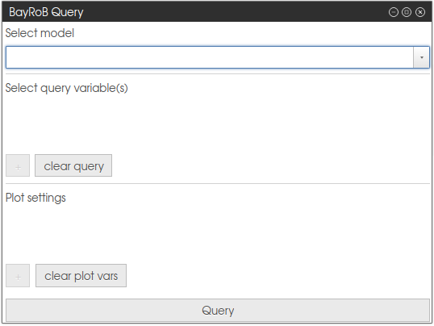
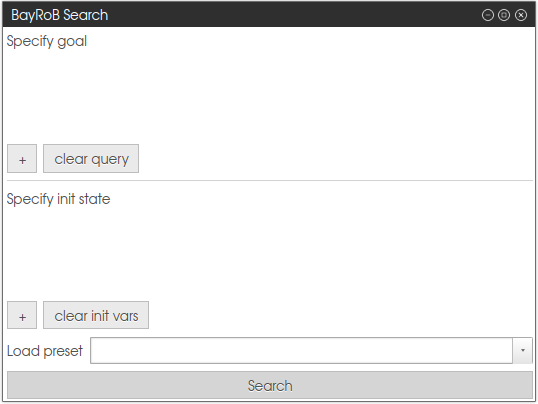
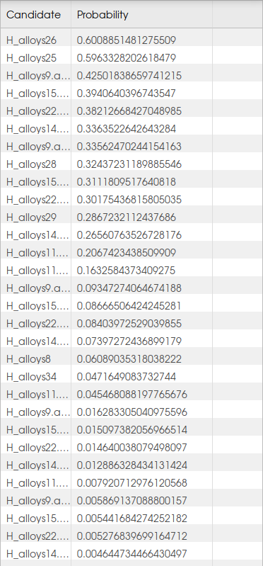
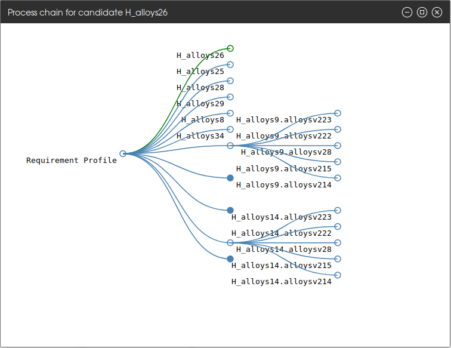

For Users
=========

|project| provides a web interface that allows to

 - do things
 - and even do more things

.. _Usage:

Usage
-----

The |project| reasoning can be executed by graphically defining a requirement profile for the desired
material to find. Clicking on the button named `Query Model` opens a new window
(:num:`Fig. #webif-query`: :ref:`webif-query`) that allows to select
a model to be queried and specify observations that are passed as evidence to the reasoning system.

...

Clicking the `Query`-button will trigger the reasoning process.

.. _webif-query:

    |project| Query

    The |project| Query window.

The results of the reasoning process will be shown in two ways. The first one is a visualization ...
(see :num:`Fig. #webif-hyps`: :ref:`webif-hyps`). The distributions plots can be downloaded as ``.svg`` files.

.. _webif-hyps:

    Query Results: Probability distributions

    The visualization of the query results allows to compare the ground truth with the computed (posterior) distributions.

The second way to investigate the results is to check the generated candidates in the table on the right
(see :num:`Fig. #webif-table`: :ref:`webif-table`). Here, each candidate is listed along with its respective probability.
This probability denotes how likely the requirement profile is matched given the process pipeline represented by this
candidate was executed with the respective parameters.

.. _webif-table:

    Query Results: Additional information

    The text provides additional information about the reasoning process.

...
(see :num:`Fig. #webif-tree`: :ref:`webif-tree`). ...

.. _webif-tree:

    Process Chains

    The resulting suggested process chains for the query.

The hypotheses can also be downloaded as JSON or XLS file, the visualization as SVG file to allow the easy comparison of
results of different queries.

Analysis
--------

Users can upload their own datafiles and perform basic data analysis using |project|. The upload is limited in the
number, size and type of the files. The uploaded data will only be stored temporarily and is deleted once the user's
session expires. The uploaded data is not available for anyone else but the user who uploaded them.

The tools can handle data that is uploaded in a semicolon-separated .csv-file in the following format as exemplified
in :ref:`table-acceptedformat`:

  - | The first row contains the header information. Feature names that start with `target_` will automatically be considered target features.
    | This may not make a difference for some of the analysis tools.
  - | The second row contains information in which unit the respective column is measured, e.g. %, MPa, °C. Leave empty if there is no unit.
  - | Each of the following rows is considered one training example. Values must be numeric, i.e. integers or floats.
    | **Exception 1:** the ``id`` value can be of type string.
    | **Exception 2:** if an enum for the specific column type exist, other values are allowed. Currently known enums: Element (mapping a symbol from the Periodic Table to its atomic number)
  - | Missing values can be identified by inserting a default value that can be replaced later.
  - | **(optional)** If a column named ``id`` exists, its values will serve as identifiers for each training sample, which allows to investigate inference results later and retrieve examples the results base on.
    | If this column does not exists or its values are empty, each sample will automatically be assigned an id in ascending order.

.. _table-acceptedformat:

.. table:: Example: Accepted Table-format

    +---------------+----------------+------+-----------+-----------------+------+---------------------+
    | id            | num_passengers | \... | avg_speed | target_distance | \... | target_fuel_savings |
    +---------------+----------------+------+-----------+-----------------+------+---------------------+
    |               |                | \... | km/h      | km              | \... | %                   |
    +===============+================+======+===========+=================+======+=====================+
    | e\ :sub:`0`\  |       1        | \... |    75     |     400.4       | \... |      0.1234         |
    +---------------+----------------+------+-----------+-----------------+------+---------------------+
    | e\ :sub:`1`\  |       3        | \... |    61     |     1000.3      | \... |       0.98          |
    +---------------+----------------+------+-----------+-----------------+------+---------------------+
    | \...          |      \...      | \... |    \...   |     \...        | \... |       \...          |
    +---------------+----------------+------+-----------+-----------------+------+---------------------+
    | e\ :sub:`t`\  |       4        | \... |    100    |     810.7       | \... |       0.56          |
    +---------------+----------------+------+-----------+-----------------+------+---------------------+

The data analysis section currently comprises the following algorithms:

    - **Clustering**, using the ``sklearn.cluster.DBSCAN`` algorithm (see `sklearn.cluster.DBSCAN <https://scikit-learn.org/stable/modules/generated/sklearn.cluster.DBSCAN.html>`_)
    - **PCA**, using the ``sklearn.decomposition.PCA`` algorithm (see `sklearn.decomposition.PCA <https://scikit-learn.org/stable/modules/generated/sklearn.decomposition.PCA.html>`_)
    - **Regression** Trees, using a modified version of the ``sklearn.tree.DecisionTreeRegressor`` (see :class:`matcalo.core.algorithms.RegressionTree` and `sklearn.tree.DecisionTreeRegressor <https://scikit-learn.org/stable/modules/generated/sklearn.tree.DecisionTreeRegressor.html>`_ for details)

Each of the tools allows to copy the textual results and download the visualization as .svg file.

Clustering
~~~~~~~~~~

.. note::
    This page is under construction

PCA
~~~

.. note::
    This page is under construction

Regression Trees
~~~~~~~~~~~~~~~~

.. note::
    This page is under construction