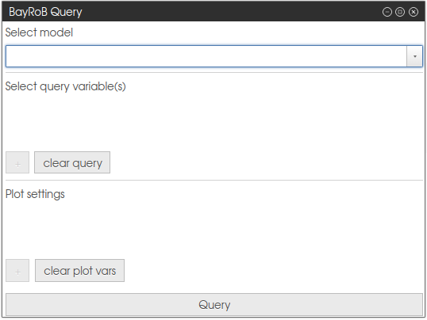

# Reasoning

BayRoB reasoning can be executed by defining a query...

Clicking the `Query`-button will trigger the reasoning process.

\
*The BayRoB Query window*

The results of the reasoning process will be shown in two ways. The first one is a visualization
The distributions plots can be downloaded as ``.svg`` files.

\
*The visualization of the query results allows to compare the ground truth with the computed (posterior) distributions.*
